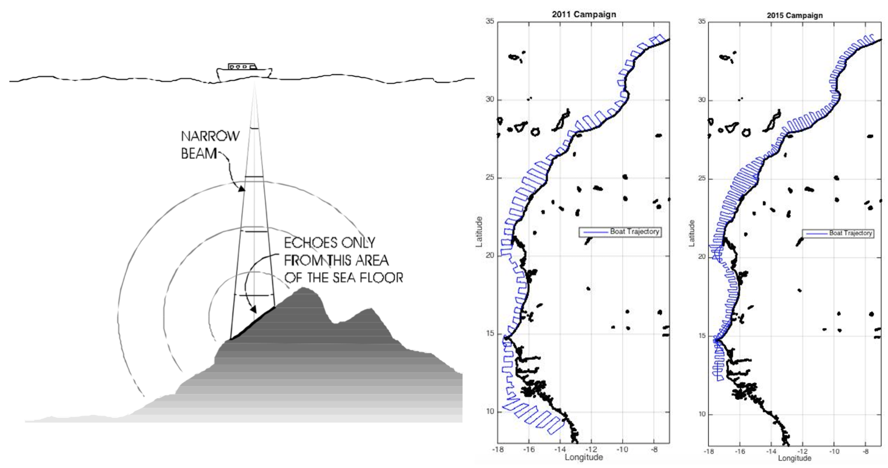
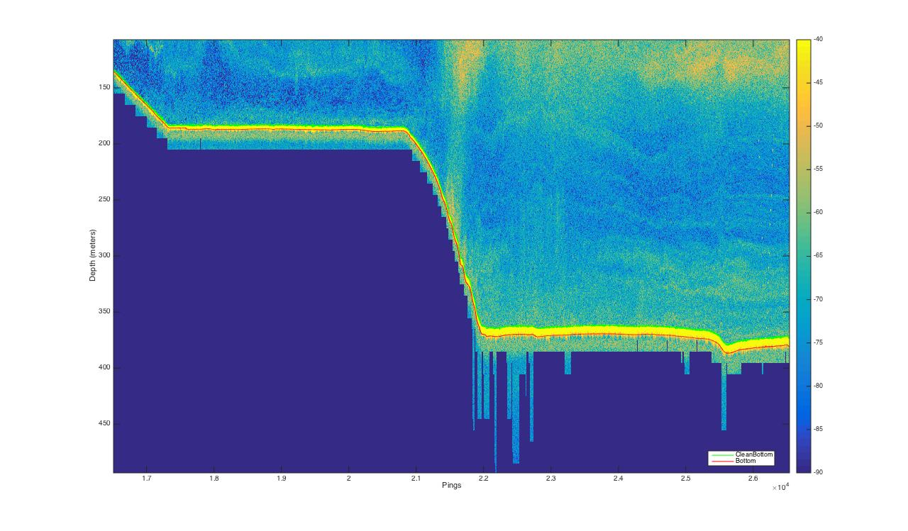
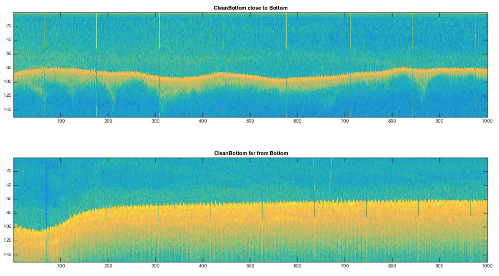
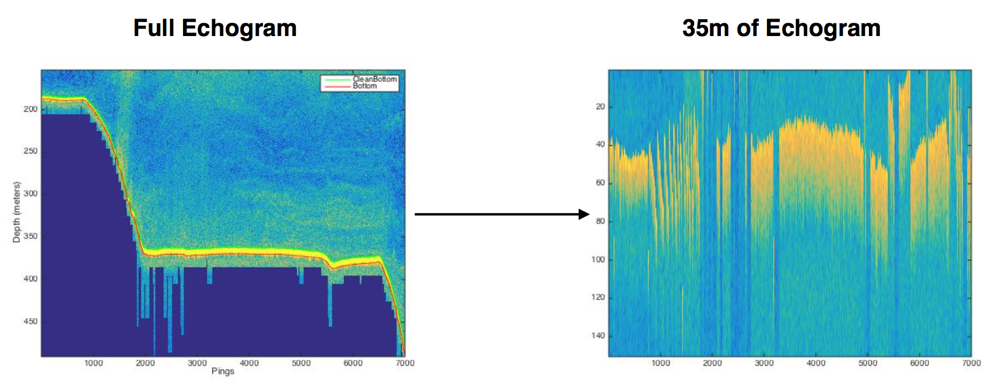
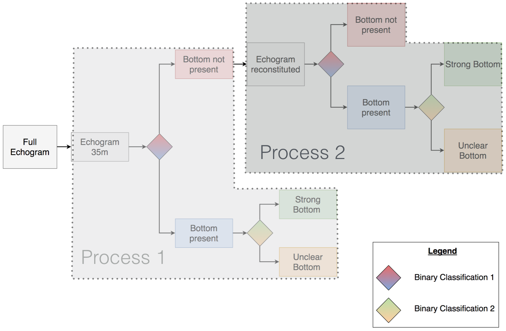
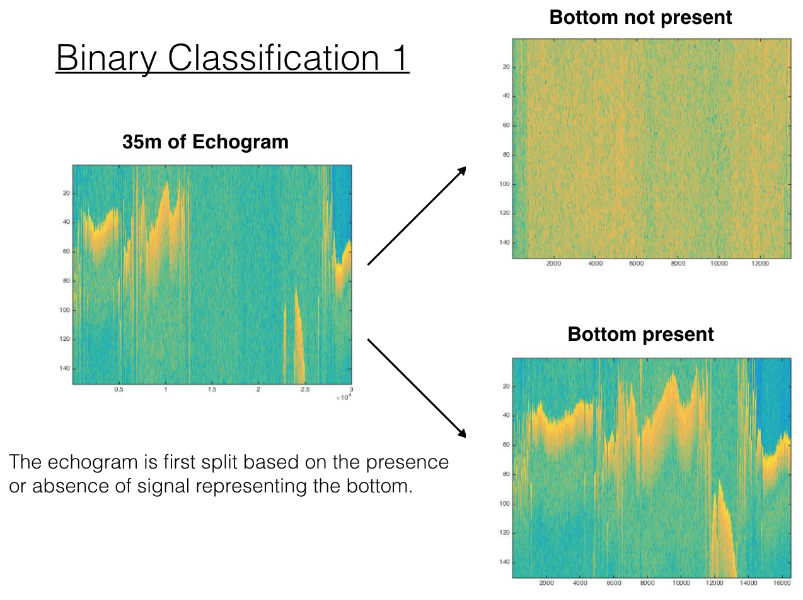
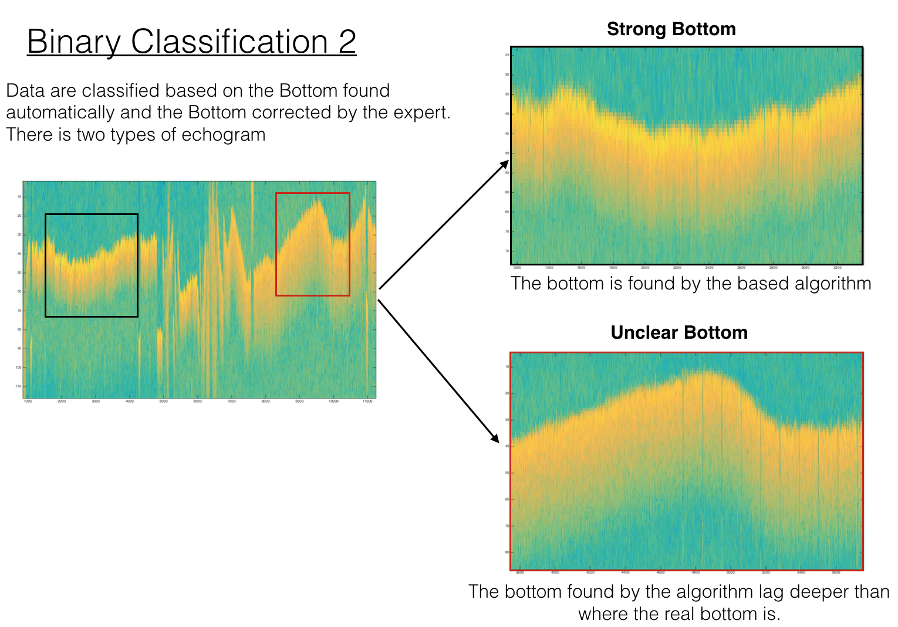

# Seafloor-Classification
## Overview

Huge databases of submarine active acoustic data (echogram) have been collected along the West African coast, 
essentially for fish stock estimation. This task is usually done with echo integration. But the first step is to clearly identify the bottom position on the echogram.  Automatic procedures to detect the bottom depth are not successful when the echogram is unclear, it occurs when the bottom texture is soft or when high-density of fish is present near the seabed. Thus, human expertise is required to review and adjust the bottom prediction made by basic procedures. This data labeling task is typically expensive because all the dataset has to be reviewed. This work aims to use deep learning techniques to classify the echogram, because those models have proven to reach good performance on large datasets, and are able to extract knowledge from complex data. Hence we train a neural network procedure to classify the echogram in different categories depending on whether the bottom is present or not in the echogram and whether it is clear or unclear, i.e. need expert correction. The end goal is to help the expert focus only on the portion of the echogram that needs to be corrected and reduce the total cost of the data labeling process.

### Data
Data are acquired with an echo sounder. The vessel sends out pulses of various frequency’s acoustic waves in the water, those waves are reflected back to the source when they meet diverse organisms (fish, plankton, etc) or more generally solid objects. We call echogram (echo more informally) the corresponding signal.

In the image below
* To the left: the sonar principle is shown at a regular interval the vessel send a pulse of acoustic wave and measure the
reflection in decibel (dB)
* To the right: the path taken by the vessel to collect the data in 2011 and 2015.

 Each pulse is called a ping, and we call echogram (echo more informally) the corresponding signal. After having discussed with the experts' team it appeared that the following variables were relevant to learn from data: Echogram, Depth, Bottom and CleanBottom. For our purpose, following the expert advice we only worked with the lowest frequency (18 kHz) to draw the bottom line (Mainly because it goes deeper). 

* Depth is a vertical grid with a regular spacing and each cell correspond to a value of depth in meters.
* Echogram is associated with Depth, in fact for every ping and every depth there is an echogram value (in dB) .
* Bottom are the value of depth given by the automated procedure (in meters).
* CleanBottom are the values of the bottom after the expert work (in meters).

In summary, the echogram can be viewed as a snapshot of the water where at each time interval (ping) we have diverse values in dB (figure shown below).

### Context
The task of deriving the true depth of the bottom is expensive because it requires an expert to go through all the echogram (~2-3 millions of pings) and adjust if necessary the bottom prediction of the automatic procedure. In fact, often the errors made by the automatic treatment of the echogram are due to their inability to accurately predict the bottom depth when the seafloor texture is soft or when high density of fish are present close to the seabed.

Hence our goal is to train a machine learning precedure to classify pings in three class:
* The bottom appear clearly (upper picture) 
* The bottom doesn't appear clearly (lower picture)
* There is no Bottom (the instrument measure down to 500 meters below sea level)

### Preprocessing & Data Labeling Process
The echogram is the input of the model. For training we took the 2011 campaign, it consist of 2,661,003 columns and 2,581 rows, each column is a ping and each column has the echogram value (in dB) corresponding to a given depth. However below the actual bottom there is Nan values, due to the data collection settings. In the whole echogram there is too many cells with Nans and it destabilize the learning process even if we replace them with sounded numerical values. So our process takes only 35 meters of echogram above the shallowest Nan value (35 meters of echogram correspond to 150 cells). Then our input data shrank to a [150,2661003] array.

This process gives a suitable format to feed a deep learning model, but there are things to discuss still. In fact we can notice that the Nans are not perfectly uniform below the bottom, so there are parts of the 35m echogram without a bottom in our data (figure above). To adress this issue we derived the following system.

#### The System
The first thing to notice is that in the system has two basic operations and two processes.

##### Process 1
As we said earlier there are part of the 35m of echograms without bottom, so we first classify the pings based on the presence or absence of bottom. Since the echogram is just a table with numerical value i.e each ping as a set of value in dB, we notice that the presence of bottom is usually link to a strong reflection (yellow collor) so we can fix a threshold to separate all the pings based on that. Hence we have two classes 
* Bottom present
* Bottom not present

We have to keep in mind that the pings of the 35m echogram without bottom may actually contains a bottom if we take the full echogram. This is the reasoning behind process 2. But before going further let's explain the second classification.

If we take the part of the echogram where bottom is present, now we want to split it into two classes again
* Bottom clear
* Bottom unclear

In short the class Bottom clear represent pings where the difference between the expert depth prediction and the automatic procedure depth prediction was low (below a certain threshold: ~3 meters). 
Similarly the class bottom unclear is made of pings where the the difference between those predictions are above this threshold.

The process 2 do the same basic operations on the echogram reconstituted, the first binary classification definitely set apart the pings that do not contains any bottom, and those that do. and the second binary classification set apart the pings where the bottom is present into bottom clear and bottom unclear.

So at the end every ping belong to a class
* Bottom not present
* Bottom clear
* Bottom unclear

### Machine Learning Design Procedure

